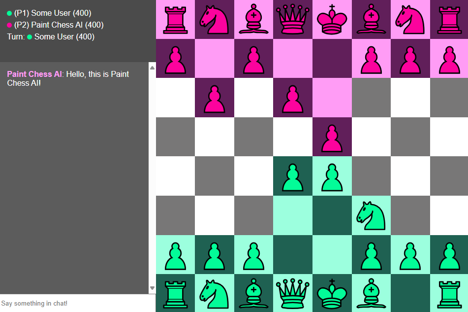

# Paint Chess

## Get Started
Click [here](https://paint-chess.onrender.com/) to get started right away! All you need to play is a web browser and an internet connection.

## Features
* Playing timed chess games with other users.
* Playing games with an AI.
* Generating invite links to share with others so they can join.
* Generating QR codes to show others so they can join your game.
* In-game chat system.
* Rating-system (ELO).

## Overview
Paint Chess is a chess variant where the pieces leave behind paint when they move. For more information, click [here](https://paint-chess.onrender.com/how-to-play).

### Differences
The big difference with this variant is the paint mechanic. At the start of a game, each player's pieces is assigned to a color. When a player moves one of their pieces, it leaves behind a paint trail along the path that it moved. This trail can stop opponent pieces from moving through.

Since the colors are no longer white and black, the starting player is no longer determined by color. Rather, at the start of the game, each player is randomly designated as either Player 1 (P1) or Player 2 (P2). The user designated as Player 1 always moves first and acts as if they were white in standard chess. You can tell what designation you received by looking at the additional UI around the board.

### Rules
This variant follows usual chess rules. A player can win if they checkmate the opponent or if the opponent resigns. A player loses if they run out of time. No player wins if a stalemate occurs.

All pieces except knights leave a trail over where they moved. Since knights jump over pieces, they only leave a trail at the squares they moved from and where they landed.

A piece cannot move go through a square painted by the opponent's pieces. A piece can move freely past unpainted squares, and squares painted by your own pieces. A piece can paint over opponent paint by moving to that square. Note that a piece can only paint over the opponent's paint 1 square at a time.

## Technologies Used
Paint Chess has a backend written in the [Deno](https://deno.com/) ([TypeScript](https://www.typescriptlang.org/)) runtime along with a front-end written in HTML+CSS+JavaScript.

### Back-End
The back-end uses several libraries:
* [Express](https://expressjs.com/) for routing.
* [express-session](https://www.npmjs.com/package/express-session) for handling user sessions.
* [Handlebars](https://handlebarsjs.com/) for templating.
* [socket.io](https://socket.io/) for sockets.
* [bcrypt](https://www.npmjs.com/package/bcryptjs) for password hashing and salting.
* [Deno MongoDB Driver](https://deno.land/x/mongo@v0.34.0) for accessing the MongoDB databse.
* [dotenv](https://www.npmjs.com/package/dotenv) for managing secret files.

### Front-End
The front-end is moslty vanilla HTML+CSS+JavaScript. However a [library](https://davidshimjs.github.io/qrcodejs/) is used for generating QR codes.

### Database
A [MongoDB](https://www.mongodb.com/) database is used.

## Credits
I would like to thank [lichess](https://github.com/lichess-org/lila) for inspiration for making this project. Credits to [Colin M.L. Burnett](https://en.wikipedia.org/wiki/User:Cburnett) for making the `cburnett` piece set and to [Enigmahack](https://github.com/Enigmahack) for the sound effects.
